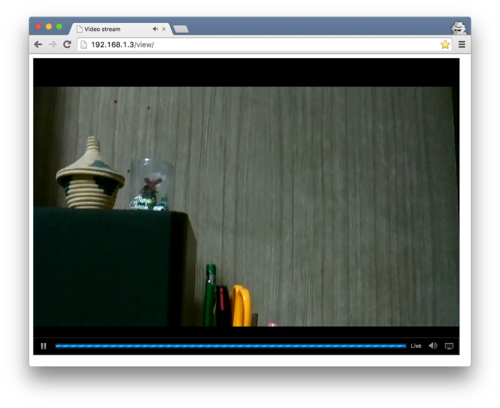

# Video-Streaming with Raspberry Pi

Stream Video from Raspberry Pi to Network and/or Youtube with [PiCam](https://github.com/iizukanao/picam).



## Install PiCam

<https://github.com/iizukanao/picam#using-a-binary-release>

Install and update dependencies

```sh
sudo apt update && sudo apt upgrade
sudo apt install libharfbuzz-dev libfontconfig1 -y
```

Create picam folder

```sh
mkdir ~/picam
```

Copy script/content from: [scripts/symlink.sh](./scripts/symlink.sh)

```sh
nano ~/picam/symlink.sh
```

Make script executable and run it

```sh
chmod +x symlinks.sh
./symlinks.sh
```

Install picam binary

```sh
wget https://github.com/iizukanao/picam/releases/download/v2.0.7/picam-2.0.7-`uname -m`.tar.xz
tar xvf picam-2.0.7-*.tar.xz
cp picam-2.0.7-*/picam ~/picam/
```

Cleanup files

```sh
rm -rf picam-2.0.7-*
mv symlinks.sh ~/picam/
```

Disable legacy camera

```sh
sudo raspi-config
#Interface Options -> Legacy Camera -> NO
```

Start picam

```sh
cd ~/picam && ./picam
```

---

## Install Nginx-RTMP

<https://github.com/arut/nginx-rtmp-module/wiki/Getting-started-with-nginx-rtmp>

Install Build utils

```sh
sudo apt-get install build-essential libpcre3 libpcre3-dev libssl-dev git zlib1g-dev -y
```

Create build dir

```sh
mkdir ~/build && cd ~/build
```

Get nginx-rtmp-module

```sh
git clone https://github.com/arut/nginx-rtmp-module
```

Get nginx (use latest version: <https://nginx.org/download/>)

```sh
sudo wget http://nginx.org/download/nginx-1.23.1.tar.gz
sudo tar xzf nginx-1.23.1.tar.gz
cd nginx-1.23.1
```

Build nginx with nginx-rtmp

```sh
sudo ./configure --with-http_ssl_module --add-module=../nginx-rtmp-module
sudo make
sudo make install
```

Start nginx server

```sh
sudo /usr/local/nginx/sbin/nginx
```

Replace nginx-config from: [nginx/nginx.conf](./nginx/nginx.conf)

```sh
sudo nano /usr/local/nginx/conf/nginx.conf
```

Restart nginx

```sh
sudo /usr/local/nginx/sbin/nginx -s stop
sudo /usr/local/nginx/sbin/nginx
```

Cleanup build files

```sh
cd ~ && sudo rm -rf ./build
```

Start picam

```sh
cd ~/picam && ./picam --tcpout tcp://127.0.0.1:8181
```

Test with VLC -> Network -> <rtmp://raspberry-ip/picam/live>

---

## Stream to Youtube

Get STREAM_URL/STREAM_KEY from Youtube Studio -> Start Livestream

Start ffmpeg stream with:

```sh
ffmpeg -i tcp://127.0.0.1:8181?listen -c:v copy -c:a aac -f flv STREAM_URL/STREAM_KEY
```

Test with Browser -> <https://www.youtube.com/stream-url>

---

## Persist Restart

### Nginx

To autostart nginx add [services/nginx.service](./services/nginx.service) to:

```sh
sudo nano /etc/systemd/system/nginx.service
```

Start/Stop/Status Service with

```sh
sudo service nginx start/stop/status
```

And persist after reboot with

```sh
sudo systemctl enable nginx
```

### Symlinks

To create symlinks on startup edit:

```sh
sudo nano /etc/rc.local
```

Add following before `exit 0`:

```sh
# Set symlinks for picam 
/home/pi/picam/symlink.sh
```

### PiCam

Create following script from: [scrips/picam.sh](./scrips/picam.sh)

```sh
nano ~/picam.sh
```

Make it executable

```sh
chmod +x ~/picam.sh
```

Install netcat to wait for nginx

```sh
sudo apt install netcat
```

To autostart PiCam create from: [services/picam.service](./services/picam.service)

```sh
sudo nano /etc/systemd/system/picam.service
```

Start/Stop/Status of Service with

```sh
sudo service youtube start/stop/status
```

And persist after reboot with

```sh
sudo systemctl enable picam
```

### Youtube

Copy STREAM_URL/STREAM_KEY to:

```sh
nano ~/Documents/youtube.txt
```

Create following script from: [scrips/youtube.sh](./scrips/youtube.sh)

```sh
nano ~/youtube.sh
```

Make it executable

```sh
chmod +x ~/youtube.sh
```

To autostart Youtube-Stream create from: [services/youtube.service](./services/youtube.service)

```sh
sudo nano /etc/systemd/system/youtube.service
```

Start/Stop/Status of Service with

```sh
sudo service youtube start/stop/status
```

And persist after reboot with

```sh
sudo systemctl enable youtube
```

---

## More

- To stream HLS in local network see [docs/HLS.md](./docs/HLS.md)
- To use node-server instead of NGINX-RTMP see [docs/NODE.md](./docs/NODE.md)

## Links

- [github.com/iizukanao/picam](https://github.com/iizukanao/picam)
- [NGINX-based Media Streaming Server](https://github.com/arut/nginx-rtmp-module)
- [Five Ways To Run a Program On Your Raspberry Pi At Startup](https://www.dexterindustries.com/howto/run-a-program-on-your-raspberry-pi-at-startup/)
- [How to see full log from systemctl status service?](https://unix.stackexchange.com/questions/225401/how-to-see-full-log-from-systemctl-status-service/225407#225407)
- [NGINX systemd service file](https://www.nginx.com/resources/wiki/start/topics/examples/systemd/)
- [nginx.service: Can't open PID file /run/nginx](https://askubuntu.com/questions/1113319/nginx-service-cant-open-pid-file-run-nginx/1113509#1113509)
